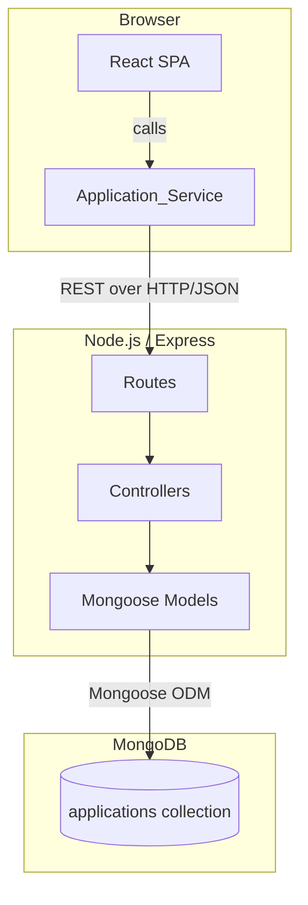
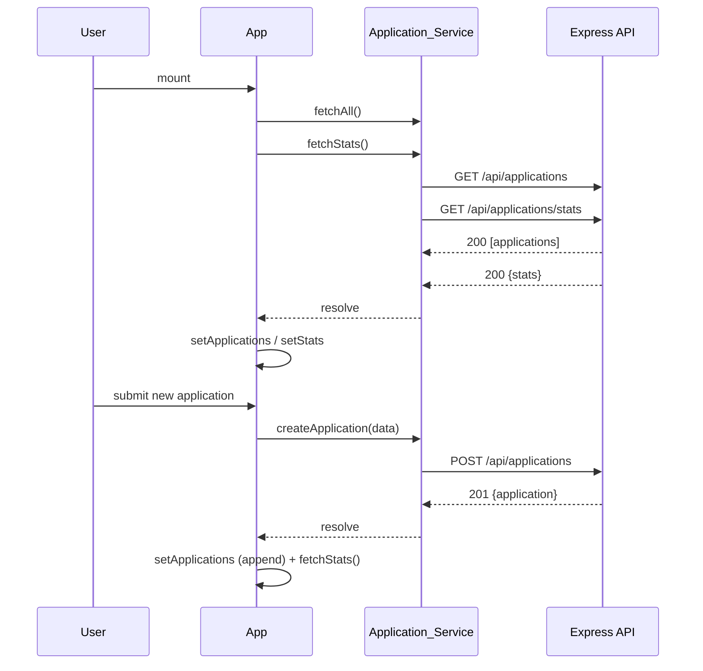

# Design Document — CareerFlow

## Overview

CareerFlow is a single-page MERN stack application that lets students and job seekers track job and internship applications without any authentication. Users can create, read, update, and delete application records; search and filter them on the frontend; and view a live statistics dashboard.

The system is split into two independently deployable processes:

- **Frontend** — React.js (Vite) SPA served as static files. Communicates with the backend exclusively through a dedicated `Application_Service` module.
- **Backend** — Node.js + Express.js REST API that applies business logic, validates inputs, and persists data to MongoDB via Mongoose.

There is no authentication layer. All API endpoints are public.

---

## Architecture

### High-Level System Diagram



### Request / Response Flow

1. A user interaction triggers a function call on `Application_Service`.
2. `Application_Service` issues an HTTP request (Fetch API) to the Express backend.
3. The Express router delegates to the appropriate controller function.
4. The controller validates inputs, calls Mongoose model methods, and returns a JSON response.
5. `Application_Service` resolves or rejects the promise.
6. React state is updated, triggering a re-render.

### Deployment Topology

| Concern | Technology | Port (dev) |
|---|---|---|
| Frontend | Vite dev server / static build | 5173 |
| Backend | Express.js | 5000 |
| Database | MongoDB | 27017 |

In development the Vite proxy forwards `/api/*` requests to `http://localhost:5000`, eliminating CORS issues.

---

## Components and Interfaces

### Frontend Component Hierarchy

```
App
├── Stats_Panel
│     └── StatCard (×5)
├── SearchBar
├── StatusFilter
├── Application_Form (modal / inline)
└── Application_List
      └── Application_Card (×N)
            └── [Detail view / Edit button / Delete button]
```

### Component Responsibilities

| Component | Responsibility |
|---|---|
| `App` | Root state owner. Holds `applications[]`, `stats`, `loading`, `error`, `searchText`, `statusFilter`. Passes handlers down as props. |
| `Stats_Panel` | Receives `stats` object and `loading` / `error` booleans. Renders five `StatCard`s. |
| `StatCard` | Purely presentational. Renders a label + count. |
| `SearchBar` | Controlled input. Calls `onSearch(text)` on change. No state. |
| `StatusFilter` | Controlled select (`All | Applied | Interview | Selected | Rejected`). Calls `onFilterChange(value)` on change. |
| `Application_Form` | Controlled form for create / edit. Owns local draft state. Runs client-side validation before calling `onSubmit(data)`. |
| `Application_List` | Receives filtered `applications[]`. Renders `Application_Card` per item. Shows empty-state when array is empty. |
| `Application_Card` | Receives a single `application` object. Shows summary fields. Provides Edit and Delete affordances. |

### Data Flow



---

## Data Models

### Application (Mongoose Schema)

```js
// backend/models/Application.js
const mongoose = require('mongoose');

const applicationSchema = new mongoose.Schema(
  {
    company: {
      type: String,
      required: [true, 'Company name is required'],
      trim: true,
    },
    position: {
      type: String,
      required: [true, 'Position is required'],
      trim: true,
    },
    status: {
      type: String,
      enum: {
        values: ['Applied', 'Interview', 'Selected', 'Rejected'],
        message: 'Status must be Applied, Interview, Selected, or Rejected',
      },
      required: [true, 'Status is required'],
      default: 'Applied',
    },
    applicationDate: {
      type: Date,
      required: [true, 'Application date is required'],
    },
    jobUrl: {
      type: String,
      trim: true,
      default: '',
    },
    notes: {
      type: String,
      trim: true,
      default: '',
    },
  },
  { timestamps: true }
);

module.exports = mongoose.model('Application', applicationSchema);
```

### TypeScript-style interface (frontend)

```ts
interface Application {
  _id: string;
  company: string;
  position: string;
  status: 'Applied' | 'Interview' | 'Selected' | 'Rejected';
  applicationDate: string; // ISO 8601
  jobUrl?: string;
  notes?: string;
  createdAt: string;
  updatedAt: string;
}

interface Stats {
  total: number;
  applied: number;
  interview: number;
  selected: number;
  rejected: number;
}
```

---

## API Endpoint Design

All endpoints are prefixed with `/api`.

### `GET /api/applications`

Returns all application records.

- **Response 200**: `Application[]`
- **Response 500**: `{ message: string }`

### `GET /api/applications/stats`

> **Note**: This route must be registered *before* `GET /api/applications/:id` in Express so that the literal `stats` segment is not mistaken for a dynamic `:id`.

Returns aggregate counts per status.

- **Response 200**: `Stats`
- **Response 500**: `{ message: string }`

**Controller logic**:
```js
const total = await Application.countDocuments();
const applied   = await Application.countDocuments({ status: 'Applied' });
const interview = await Application.countDocuments({ status: 'Interview' });
const selected  = await Application.countDocuments({ status: 'Selected' });
const rejected  = await Application.countDocuments({ status: 'Rejected' });
```

### `GET /api/applications/:id`

Returns a single record by MongoDB ObjectId.

- **Response 200**: `Application`
- **Response 404**: `{ message: 'Application not found' }`
- **Response 500**: `{ message: string }`

### `POST /api/applications`

Creates a new record.

- **Request body**: `{ company, position, status, applicationDate, jobUrl?, notes? }`
- **Response 201**: `Application`
- **Response 400**: `{ message: string }` (validation errors from Mongoose)
- **Response 500**: `{ message: string }`

### `PUT /api/applications/:id`

Updates an existing record.

- **Request body**: any subset of Application fields
- **Response 200**: `Application` (updated document)
- **Response 400**: `{ message: string }`
- **Response 404**: `{ message: 'Application not found' }`
- **Response 500**: `{ message: string }`

**Controller option**: `{ new: true, runValidators: true }`

### `DELETE /api/applications/:id`

Deletes a record.

- **Response 200**: `{ message: 'Application deleted successfully' }`
- **Response 404**: `{ message: 'Application not found' }`
- **Response 500**: `{ message: string }`

---

## Frontend Service Layer

`Application_Service` (`frontend/src/services/applicationService.js`) is the **only** module that makes HTTP calls. All components receive data and callbacks from `App`; they never call the service directly.

```js
const BASE_URL = '/api/applications';

export const fetchAll = () =>
  fetch(BASE_URL).then(handleResponse);

export const fetchStats = () =>
  fetch(`${BASE_URL}/stats`).then(handleResponse);

export const fetchById = (id) =>
  fetch(`${BASE_URL}/${id}`).then(handleResponse);

export const createApplication = (data) =>
  fetch(BASE_URL, {
    method: 'POST',
    headers: { 'Content-Type': 'application/json' },
    body: JSON.stringify(data),
  }).then(handleResponse);

export const updateApplication = (id, data) =>
  fetch(`${BASE_URL}/${id}`, {
    method: 'PUT',
    headers: { 'Content-Type': 'application/json' },
    body: JSON.stringify(data),
  }).then(handleResponse);

export const deleteApplication = (id) =>
  fetch(`${BASE_URL}/${id}`, { method: 'DELETE' }).then(handleResponse);

// Converts non-2xx responses into thrown errors with the API error message
async function handleResponse(res) {
  const body = await res.json();
  if (!res.ok) throw new Error(body.message || 'Unexpected error');
  return body;
}
```

---

## State Management

All shared state lives in the root `App` component, managed with `useState` and `useEffect` hooks. There is no external state library.

### State Shape

```js
const [applications, setApplications] = useState([]);   // full list from API
const [stats, setStats]               = useState(null);
const [loading, setLoading]           = useState(false);
const [statsLoading, setStatsLoading] = useState(false);
const [error, setError]               = useState(null);
const [statsError, setStatsError]     = useState(null);
const [searchText, setSearchText]     = useState('');
const [statusFilter, setStatusFilter] = useState('All');
const [selectedId, setSelectedId]     = useState(null); // for detail view
const [editTarget, setEditTarget]     = useState(null); // null = create mode
```

### Derived State (computed, not stored)

```js
const filteredApplications = applications
  .filter(a =>
    statusFilter === 'All' || a.status === statusFilter
  )
  .filter(a =>
    a.company.toLowerCase().includes(searchText.toLowerCase()) ||
    a.position.toLowerCase().includes(searchText.toLowerCase())
  );
```

Both filters are **pure functions over the already-fetched `applications` array** — no additional API calls are made.

### Data Refresh Strategy

After each mutating operation (create, update, delete), `App` calls both `fetchAll()` and `fetchStats()` again to keep the list and dashboard in sync. This keeps state management simple and avoids manual list splicing.

---

## Error Handling

### Backend

```
Request
  │
  ▼
Route handler
  │  try / catch
  ▼
Controller function ──── Mongoose ValidationError ──► 400 + error.message
                     ──── CastError (bad ObjectId) ──► 404
                     ──── Not found (null doc)      ──► 404
                     ──── All other errors          ──► pass to error middleware

Global error middleware  ──► 500 + generic message + server-side log
```

Express global error middleware (registered last):

```js
// backend/middleware/errorHandler.js
module.exports = (err, req, res, next) => {
  console.error(err.stack);
  res.status(500).json({ message: 'Internal server error' });
};
```

Mongoose `ValidationError` is handled inside each controller's `catch` block:

```js
catch (err) {
  if (err.name === 'ValidationError') {
    return res.status(400).json({ message: err.message });
  }
  if (err.name === 'CastError') {
    return res.status(404).json({ message: 'Application not found' });
  }
  next(err); // forwards to global error middleware
}
```

### Frontend

`Application_Service.handleResponse` throws an `Error` for any non-2xx response, carrying the API's `message` string.

`App` wraps each service call in try/catch:

```js
setLoading(true);
setError(null);
try {
  const data = await fetchAll();
  setApplications(data);
} catch (err) {
  setError(err.message);
} finally {
  setLoading(false);
}
```

The `error` and `statsError` strings are passed as props to the relevant components, which render them in a visible error banner.

### Frontend URL Validation

Before form submission, `Application_Form` validates `jobUrl` with the native URL constructor:

```js
function isValidUrl(value) {
  if (!value) return true; // optional field
  try {
    new URL(value);
    return true;
  } catch {
    return false;
  }
}
```

---

## Project Directory Structure

```
careerflow/
├── backend/
│   ├── controllers/
│   │   └── applicationController.js
│   ├── middleware/
│   │   └── errorHandler.js
│   ├── models/
│   │   └── Application.js
│   ├── routes/
│   │   └── applicationRoutes.js
│   ├── server.js
│   └── package.json
│
└── frontend/
    ├── public/
    ├── src/
    │   ├── components/
    │   │   ├── Application_Card.jsx
    │   │   ├── Application_Form.jsx
    │   │   ├── Application_List.jsx
    │   │   ├── SearchBar.jsx
    │   │   ├── StatCard.jsx
    │   │   ├── Stats_Panel.jsx
    │   │   └── StatusFilter.jsx
    │   ├── services/
    │   │   └── applicationService.js
    │   ├── App.jsx
    │   └── main.jsx
    ├── index.html
    ├── vite.config.js
    └── package.json
```

---

## Correctness Properties

*A property is a characteristic or behavior that should hold true across all valid executions of a system — essentially, a formal statement about what the system should do. Properties serve as the bridge between human-readable specifications and machine-verifiable correctness guarantees.*

### Property 1: Valid POST returns created record

*For any* valid Application payload (with all required fields present and a well-formed `applicationDate`), `POST /api/applications` shall return HTTP 201 and a response body whose `company`, `position`, `status`, `applicationDate`, `jobUrl`, and `notes` fields match the submitted values.

**Validates: Requirements 1.1**

---

### Property 2: Missing required field returns 400

*For any* POST /api/applications payload that is missing at least one of `company`, `position`, `status`, or `applicationDate`, the backend shall return HTTP 400.

**Validates: Requirements 1.5**

---

### Property 3: Whitespace-only company or position is invalid

*For any* string composed entirely of whitespace characters, the frontend form validation shall reject it as an invalid value for `company` or `position` (i.e., prevent form submission).

**Validates: Requirements 1.4**

---

### Property 4: URL validator accepts valid URLs and rejects invalid ones

*For any* string `s`, the `isValidUrl` function shall return `true` if and only if `s` is parseable by the WHATWG URL standard (i.e., `new URL(s)` does not throw).

**Validates: Requirements 1.6**

---

### Property 5: Application_List renders exactly what the API returns

*For any* array of Application objects returned by the API, the rendered `Application_List` shall contain exactly that many `Application_Card` elements, each corresponding to an item in the array.

**Validates: Requirements 2.1**

---

### Property 6: GET /api/applications retrieves all inserted records

*For any* set of N Application documents inserted into the database, `GET /api/applications` shall return an array of length N containing all inserted records.

**Validates: Requirements 2.2**

---

### Property 7: Application_Card renders required summary fields

*For any* Application object, the rendered `Application_Card` shall visibly display the `company`, `position`, `status`, and `applicationDate` values from that object.

**Validates: Requirements 2.6**

---

### Property 8: GET /api/applications/:id round-trip

*For any* Application inserted into the database, retrieving it by its `_id` via `GET /api/applications/:id` shall return a record with equivalent `company`, `position`, `status`, `applicationDate`, `jobUrl`, and `notes` values, with HTTP 200.

**Validates: Requirements 3.2**

---

### Property 9: Detail view renders all Application fields

*For any* Application object, the detail view shall visibly display all six fields: `company`, `position`, `status`, `applicationDate`, `jobUrl`, and `notes`.

**Validates: Requirements 3.4**

---

### Property 10: PUT /api/applications/:id returns updated record

*For any* existing Application and any valid partial update payload, `PUT /api/applications/:id` shall return HTTP 200 and a response body that reflects the updated field values while preserving unchanged fields.

**Validates: Requirements 4.2**

---

### Property 11: Search filter — inclusion and exclusion

*For any* array of Applications and any non-empty search string, the filtered result shall contain **exactly** those Applications where `company` or `position` contains the search string (case-insensitively) — no matching item shall be omitted and no non-matching item shall be included.

**Validates: Requirements 6.1**

---

### Property 12: Search filter round-trip (clear restores original list)

*For any* array of Applications and any search string, applying the search filter and then clearing it (setting search text to `""`) shall yield a result identical to the original unfiltered array.

**Validates: Requirements 6.4**

---

### Property 13: Status filter — inclusion and exclusion

*For any* array of Applications and any status value from `{Applied, Interview, Selected, Rejected}`, the filtered result shall contain **exactly** those Applications whose `status` matches the selected value.

**Validates: Requirements 7.1**

---

### Property 14: Combined filter equals intersection

*For any* array of Applications, any search string, and any status filter value, applying both filters simultaneously shall produce a result equal to the intersection of applying each filter independently (i.e., items that satisfy both the search constraint and the status constraint).

**Validates: Requirements 7.4**

---

### Property 15: Stats counts match actual data

*For any* collection of Application documents with varying statuses, `GET /api/applications/stats` shall return counts where `total` equals the total number of documents, and each status count (`applied`, `interview`, `selected`, `rejected`) equals the number of documents with that exact status value.

**Validates: Requirements 8.2**

---

### Property 16: Stats_Panel displays all five statistics

*For any* Stats object with non-negative integer values for `total`, `applied`, `interview`, `selected`, and `rejected`, the rendered `Stats_Panel` shall display all five values.

**Validates: Requirements 8.3**

---

## Error Handling

*(Consolidated from the Error Handling section above.)*

| Scenario | Backend response | Frontend behavior |
|---|---|---|
| Missing required field | 400 + validation message | Form shows inline error, blocks submit |
| Invalid `jobUrl` format | 400 (or blocked client-side) | Form shows URL error, blocks submit |
| Resource not found | 404 + `"Application not found"` | Error banner shown |
| Network / server error | 500 + generic message | Error banner shown |
| DB unavailable at startup | — | Process logs error and exits |

---

## Testing Strategy

### Dual Testing Approach

Both unit/example-based tests and property-based tests are used. They are complementary:

- **Unit / example tests** handle specific scenarios, loading states, empty states, and UI interactions.
- **Property-based tests** exercise universal correctness guarantees across a wide randomised input space.

### Property-Based Testing Library

**Vitest** (frontend) with **fast-check** as the property-based testing library.
**Jest** (backend) with **fast-check** for backend properties.

Each property test runs a minimum of **100 iterations**.

Every property test is tagged with a comment:

```js
// Feature: careerflow, Property N: <property text>
```

### Frontend Unit Tests (Vitest + React Testing Library)

- `Application_Card` renders required fields (example for each field)
- `Application_Form` shows required-field errors when fields are blank
- `Application_Form` shows URL error for malformed `jobUrl`
- `Application_List` renders empty-state when array is empty
- `Stats_Panel` shows loading indicator while pending
- `Stats_Panel` shows error message on failure
- `App` triggers `fetchStats` after create / update / delete
- No additional API calls are made when search text or status filter changes

### Frontend Property Tests (Vitest + fast-check)

Maps to Properties 3, 4, 5, 7, 9, 11, 12, 13, 14, 16.

Pure filter functions and rendering functions are extracted from components and tested in isolation without a DOM.

```js
// Example — Property 11
import * as fc from 'fast-check';
import { filterApplications } from '../utils/filterApplications';

test('Property 11: search filter inclusion and exclusion', () => {
  // Feature: careerflow, Property 11: search filter includes/excludes correctly
  fc.assert(
    fc.property(
      fc.array(applicationArbitrary()),
      fc.string(),
      (apps, query) => {
        const result = filterApplications(apps, query, 'All');
        const expected = apps.filter(a =>
          a.company.toLowerCase().includes(query.toLowerCase()) ||
          a.position.toLowerCase().includes(query.toLowerCase())
        );
        return result.length === expected.length &&
          result.every(r => expected.some(e => e._id === r._id));
      }
    ),
    { numRuns: 100 }
  );
});
```

### Backend Unit Tests (Jest)

- Controller returns 201 with valid body (example)
- Controller returns 400 for missing fields (example per field)
- Controller returns 404 for unknown id
- Controller returns 500 and delegates to error middleware on DB failure
- `GET /api/applications/stats` route resolves before `GET /api/applications/:id`

### Backend Property Tests (Jest + fast-check)

Maps to Properties 1, 2, 6, 8, 10, 15.

Use an in-memory MongoDB instance (via `mongodb-memory-server`) to keep tests self-contained and cost-free.

```js
// Example — Property 15
test('Property 15: stats counts match actual data', async () => {
  // Feature: careerflow, Property 15: stats counts match actual data
  await fc.assert(
    fc.asyncProperty(
      fc.array(applicationArbitrary(), { minLength: 0, maxLength: 50 }),
      async (apps) => {
        await Application.deleteMany({});
        await Application.insertMany(apps);
        const res = await request(app).get('/api/applications/stats');
        expect(res.status).toBe(200);
        expect(res.body.total).toBe(apps.length);
        expect(res.body.applied).toBe(apps.filter(a => a.status === 'Applied').length);
        // ... other counts
      }
    ),
    { numRuns: 100 }
  );
});
```

### Integration Tests

- Full create → read → update → delete lifecycle with a real MongoDB instance
- Stats endpoint reflects mutations after each operation
- Confirm `GET /api/applications/stats` route takes priority over `:id` when literal `stats` is used as an id
